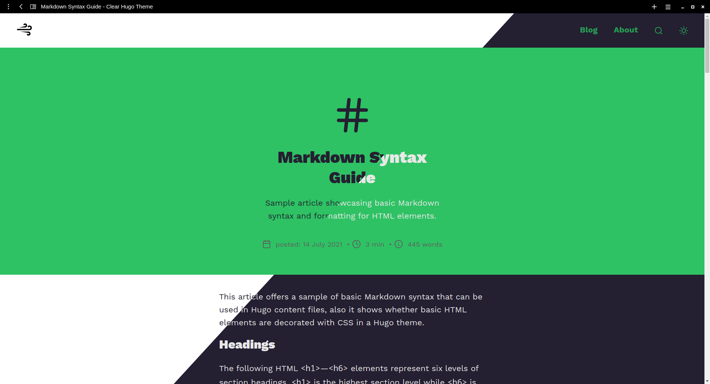

# Clear. </img>
Clear is a minimalist monolingual Hugo theme.


### Features
(version 1.0.0)
- SEO optimized
- fast
- dark mode
- custom color
- code highlighting
- fast search
- blog pagination
- comments (see [#comments](https://github.com/Kepler-69c/clear-hugo-theme#comments))
- dart-sass support

### Preview
-> [Demo](https://clear-hugo.netlify.app)


### Use the theme
First, add the theme to the main `config` file of your site (example: config.toml):
```toml
theme = "clear"
```

Then, either include the theme as a git submodule (preferred way):
```shell
git submodule add https://github.com/Kepler-69c/clear-hugo-theme.git themes/clear
```

Or alternatively, you could clone the theme:
```shell
git clone https://github.com/apvarun/blist-hugo-theme.git themes/blist
```

## Preview the theme
There is a [demo site](https://clear-hugo.netlify.app) where you can see the theme. The source for this website is in the `exampleSite/` folder. If you want to preview the the theme locally, run the following commands:
1. go to the `exampleSite/` folder
2. install all required NPM packages
```shell
npm install
```
3. run Hugo
```shell
hugo serve --themesDir ../../
```
4. visit `http://localhost:1313/` in your browser to view the example site.

> Note that for the theme to work, you need to have Hugo and dart-sass installed on your computer.

### Configuring the theme
The demo site in the `exampleSite/` folder contains the `extendedConfig.toml` file, which contains all the possible settings for the theme. Helpful comments are included.

Here you can find some of the most important settings:
- TODO

### Comments
| Comments   | Implemented | Tested |
| ---------- | ----------- | ------ |
| Giscus     | ✔︎          | ✔︎     |
| Disqus     | ✔︎          | ✔︎     |
| Utterances | ✔︎          | ✔︎     |

### Issues
If you have an issue, please feel free to post it to help those who come after you. The more information you can provide, the better!

### Contributing
Contributions, issues, and feature requests are welcome! For major changes, please open an issue first to discuss what you would like to change.

---

### planned 
(version 2.0.0)
- [ ] dark mode for comments, fix giscus dark mode
- [ ]  multilingual mode
- [ ]  table of contents
- [ ]  codeblock copy button
- [ ]  dynamic image resizing
- [ ]  post list on homepage
- [ ]  list -> timeline
- [ ]  thumbnails in posts
- [ ]  post list as grid
